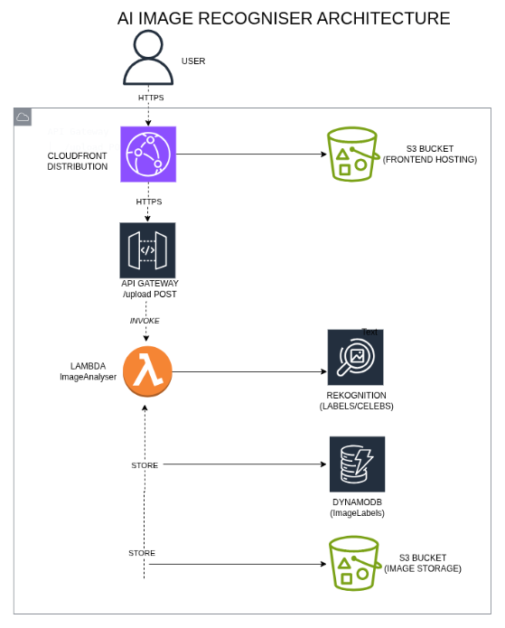

# AI Image Recognizer

A serverless web application that uses Amazon Rekognition to identify objects or recognize celebrities in uploaded images. Built with React and hosted on AWS.

## Live Demo

[dwgq2wvqywom3.cloudfront.net](https://dwgq2wvqywom3.cloudfront.net)

## Architecture

The application consists of:

- **Frontend**: React app (Vite + Tailwind) hosted on Amazon S3 and delivered globally via Amazon CloudFront.
- **API Layer**: Amazon API Gateway provides a REST endpoint (`POST /upload`).
- **Compute**: AWS Lambda (Python) processes the image, calls Rekognition, and stores results.
- **AI Services**: Amazon Rekognition performs object detection (`detect_labels`) or celebrity recognition (`recognize_celebrities`).
- **Storage**:
  - Amazon S3 (frontend bucket) hosts the static website.
  - Amazon S3 (uploads bucket) stores original images (optional).
  - Amazon DynamoDB persists analysis results (table `ImageLabels`).

### Architecture Diagram



## Services Used

- Amazon S3: static website hosting and image storage
- Amazon CloudFront: global content delivery with HTTPS
- AWS Lambda: serverless compute for image analysis
- Amazon API Gateway: REST API endpoint
- Amazon Rekognition: AI-powered object and celebrity detection
- Amazon DynamoDB: NoSQL database for storing results
- AWS IAM: least-privilege roles and permissions
- React / TypeScript / Vite: frontend framework and tooling
- Tailwind CSS: styling
- Lucide React: icons

## What I Learned

- Integrating a React frontend with a serverless AWS backend.
- Handling WebP images by converting them to JPEG in the browser using HTML Canvas (avoids Rekognition format errors).
- Working with Amazon Rekognition APIs for both label detection and celebrity recognition.
- Managing DynamoDB Decimal types for confidence scores (floats must be converted).
- Configuring API Gateway CORS and deploying with Lambda proxy integration.
- Setting up CloudFront with S3 origin and error pages for a single-page application.
- Using custom favicons and social meta tags for a polished look.
- Debugging with CloudWatch Logs and browser developer tools.

## Deployment Instructions

If you want to deploy your own version:

1. Clone this repository:

```bash
git clone https://github.com/vicGrey/AI-image-recognition.git
cd AI-image-recognition
```

2. Frontend setup:

- Navigate to `frontend/`, install dependencies (`npm install`), and update `API_URL` in `src/pages/Index.tsx` with your API Gateway endpoint.
- Build the project: `npm run build`.
- Upload the contents of `dist/` to an S3 bucket enabled for static website hosting.
- Optional: set up CloudFront as described in the project docs.

3. Backend setup:

- Create a DynamoDB table named `ImageLabels` with partition key `ImageId` (string).
- Create an S3 bucket for image uploads (keep it private).
- Deploy the Lambda function located in `backend/image-analyzer/` with these environment variables:
  - `TABLE_NAME`: your DynamoDB table name
  - `BUCKET_NAME`: your image uploads bucket name
- Attach an IAM role with permissions for DynamoDB, Rekognition, S3, and CloudWatch Logs.
- Create an API Gateway REST API with a `POST` method on `/upload` (Lambda proxy integration).
- Enable CORS and deploy the API to a stage (for example, `dev`).
- Update the frontend API URL with your deployed API Gateway endpoint, rebuild, and re-upload.

## Future Improvements

- Convert manual AWS setup to Infrastructure as Code (AWS SAM / CloudFormation).
- Add user authentication with Amazon Cognito.
- Implement image history per user (store results with user IDs).
- Set up CI/CD with GitHub Actions for automatic deployments.
- Add unit tests for Lambda and React components.

## Connect with Me

- [LinkedIn](https://www.linkedin.com/in/victor-okoroafor-cloud)
- [X (Twitter)](https://x.com/OkoroaforVic)
- [GitHub](https://github.com/vicGrey)

